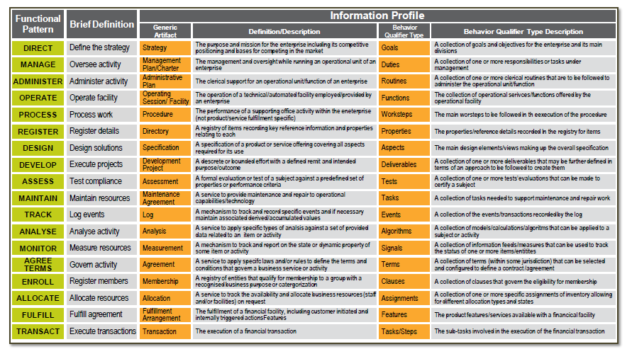
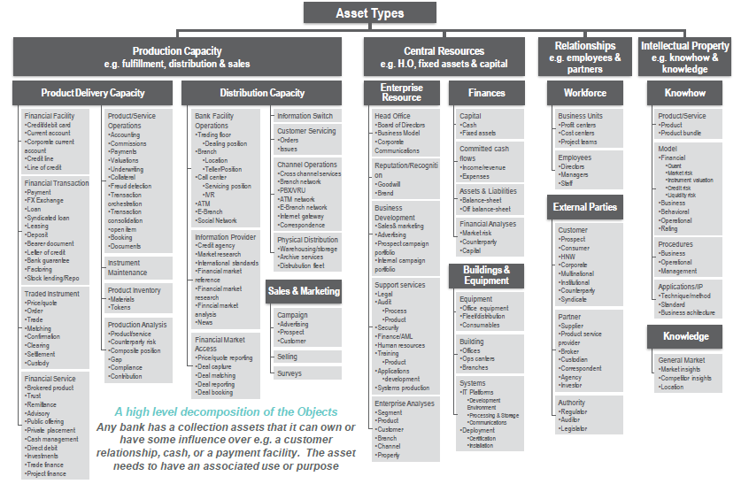
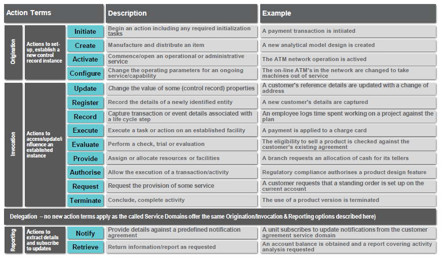
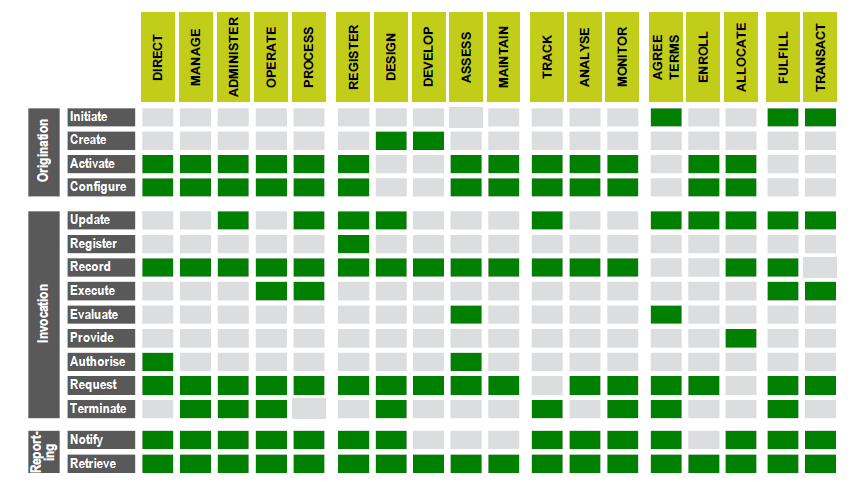
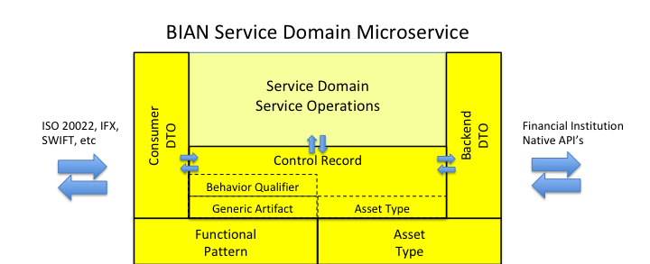

<p align="center">
  
</p>

# Halo Bian Service Domain - webfront Service

The **Halo webfront** is a Flask RESTful microservice seed implementation of the Bian Service Domain.

### Flask components

- RESTful microservice (via Flask-RESTful)
- Distributed central service configuration (via AWS SSM - on AWS Cloud and/or On Prem)
- Dynamic service registration and resolution (via AWS Serverless on AWS Cloud or Halo Bian Registry Hook for On Prem)
- Service-to-service load balancing (via AWS Serverless on AWS Cloud or K8 for On Prem)
- Service outage quick failover, state tracking and reporting (via Halo Circuit Breaker)

### Flask BIAN library components 

- BIAN functional pattern specific service classes (Functional Pattern)
- BIAN asset type base classes (Asset Type)
- BIAN generic artifact classes (Generic Artifact)
- BIAN behavior qualifier classes (Behavior Qualifier)
- BIAN control record classes (Control Record)
- BIAN service domain specific control record classes
- JSON for data mapping between front facing API and internal control record
- JSON for data mapping between internal control record and native backend payloads
- Service Operation handling with default handlers for functional pattern services per BIAN specification.
- RESTful method to BIAN service operation mapper and handling
- Service exception handling
- Service status and BIAN information endpoints

### Developer provided components 

- Service domain service operation handlers
- JSON mapping rules for front facing consumer API
- JSON mapping rules for backend native API's


## Usage

The repository contains the following module:

- webfront - the BIAN Service Domain


### Installing the service

1. Clone the repository to a local directory.


2. Build the virtual environment:

```
virtualenv venv
```

3. Activate your virtual environment:

```
venv\scripts\activate
```

4. install the libraries in your virtual environment:

```
pip install -r requirements.txt
```

### Using the Service


1. Identify the BIAN functional pattern of the service domain so your service automatically implements a host of common functionality like RESTful endpoints, messaging, error handling, in addition to BIAN functional pattern specific service operation handling.

   **extend.py**:
```
from halo_bian.bian.bian import FunctionalPatterns

SERVICE_DOMAIN = "webfront_service"
FUNCTIONAL_PATTERN = FunctionalPatterns.XXX
BEHAVIOR_QUALIFIER = {"BQ_key": "BQ_val"}
```

2. Define the service operation for each of the SWAGGER methods in the new service domain class. The SWAGGER methods requiring definition are dependent on the functional pattern.

   **api\mixin\mixin_view.py**:
```
from halo_bian.bian.bian import ServiceOperations

class CurrentAccountCurrentAccountFulfillmentArrangementMixin(AbsBianMixin):
	bian_action = ServiceOperations.RETRIEVE
```

3. Identify the payload structure of the service domain, both for internal field usage and external data standard mappings.  Optionally create a control record for your functional pattern / asset type combination.

   **CurrentAccount.py**:
```

```

4. Overwrite the method calls in the service operation which handle any necessary back-end native calls.
```
    def do_operation(self,bian_request):
        # 1. validate input params
        self.validate_req(bian_request)
        # 2. get api definition to access the BANK API  - url + vars dict
        back_api = self.set_back_api(bian_request)
        # 3. array to store the headers required for the API Access
        back_headers = self.set_api_headers(bian_request)
        # 4. Sending the request to the BANK API with params
        back_vars = self.set_api_vars(bian_request)
        back_auth = self.set_api_auth(bian_request)
        back_response = self.execute_api(bian_request, back_api, back_vars, back_headers, back_auth)
        # 5. extract from Response stored in an object built as per the BANK API Response body JSON Structure
        back_json = self.extract_json(bian_request,back_response)
        # 6. Build the payload target response structure which is IFX Compliant
        payload = self.create_resp_payload(bian_request,back_json)
        logger.debug("payload=" + str(payload))
        headers = self.set_resp_headers(bian_request,bian_request.request.headers)
        # 7. build json and add to bian response
        ret = BianResponse(bian_request, payload, headers)
        # return json response
        return ret
```

5. Implement the method calls in the service operation per behavior qualifier which handle any necessary back-end native calls.
```
    def do_operation_bq(self,bian_request):
        if bian_request.behavior_qualifier is None:
            raise IllegalBQException("missing behavior_qualifier value")
        try:
            behavior_qualifier = bian_request.behavior_qualifier.lower()
            # 1. validate in params
            getattr(self, 'validate_req_%s' % behavior_qualifier)(bian_request)
            # 2. Code to access the BANK API  to retrieve data - url + vars dict
            back_api = getattr(self, 'set_back_api_%s' % behavior_qualifier)(bian_request)
            # 3. array to store the headers required for the API Access
            back_headers = getattr(self, 'set_api_headers_%s' % behavior_qualifier)(bian_request)
            # 4. Sending the request to the BANK API with params
            back_vars = getattr(self, 'set_api_vars_%s' % behavior_qualifier)(bian_request)
            back_auth = getattr(self, 'set_api_auth_%s' % behavior_qualifier)(bian_request)
            back_response = getattr(self, 'execute_api_%s' % behavior_qualifier)(bian_request, back_api, back_vars, back_headers, back_auth)
            # 5. extract from Response stored in an object built as per the BANK API Response body JSON Structure
            back_json = getattr(self, 'extract_json_%s' % behavior_qualifier)(bian_request,back_response)
            # 6. Build the payload target response structure which is IFX Compliant
            payload = getattr(self, 'create_resp_payload_%s' % behavior_qualifier)(bian_request,back_json)
            logger.debug("payload=" + str(payload))
            headers = getattr(self, 'set_resp_headers_%s' % behavior_qualifier)(bian_request,bian_request.request.headers)
            # 7. build json and add to bian response
            ret = BianResponse(bian_request, payload, headers)
            # return json response
            return ret
        except AttributeError as ex:
            raise BianMethodNotImplementedException(ex)
```

6. start your Flask:

```
python.exe -m flask run
```

7. You have your BIAN service running on the /loc prefix!!! go to [**swagger-ui**](http://127.0.0.1:5000/loc/static/swagger-ui/index.html) and access your API methods.

8. Deploy your service to the AWS serverless cloud with the serverless utility and the out of the box setup file:

```
copy *_sls_settings.json serverless.json
serverless deploy
```


The **Halo Bian** library is based on the [**Halo**](https://github.com/halo-framework/halo-app) library which is a python based library utilizing [**Serverless**](https://logz.io/blog/serverless-vs-containers/) technology and [**microservices architecture**](http://blog.binaris.com/your-guide-to-migrating-existing-microservices-to-serverless/) 

BIAN (Banking Industry Architecture Network) is a membership group committed to developing open standards around banking and financial services.  A key deliverable of this group is the BIAN Service Landscape model which defines a comprehensive services architecture for financial transactions and facilities.  This library is an implementation of the BIAN model leveraging the Flask framework and allows a developer to **rapidly create BIAN-compliant services** while hiding much of the underlying BIAN model details.  See www.bian.org for more information on BIAN.

This library leverages not only the Flask framework, but a number of the Flask Cloud Services components as well to facilitate building robust and resilient cloud-native BIAN microservices. 
deploy your Service Domain to your local environment or use [**Serverless Framework**](https://serverless.com/) and [**zappa**](https://github.com/Miserlou/Zappa) to deploy your Service Domain to AWS.

## BIAN Basics

Before diving into the library architecture, it helps to understand two key concepts within BIAN, service domains and control records.

### Service Domain

The BIAN Service Landscape defines discrete areas of responsibility known as service domains.  A **Service Domain** is a combination of a **Functional Pattern** and an **Asset Type**.  For instance, using the functional pattern 'Registry' with the asset type 'Product' would yield a 'Product Registry' service domain, which could be used to manage a product catalog.  If we instead changed the asset type to 'Device', we would have a 'Device Registry' service domain that could be used to authorize services on a mobile device.  

### Control Record

The **Control Record** is used to track the state of a service domain, and like the service domain is derived from the functional pattern and asset type.  However, in a control record, the functional pattern is represented by the **Generic Artifact Type**.  There is a one-to-one correlation between functional patterns and generic artifact types.  The control record goes one step further in delineating between specific service domain operations by introducing an additional parameter called the **Behavior Qualifier**, which, like generic artifact types, have a one-to-one correlation with functional patterns.

### In Addition

-  The commercial behaviors that are called Functional Patterns. Functional Patterns, Generic Artifacts and Behavior Qualifier Types are mapped and correlated:     
<p/>
[**Image From Bian Manual**](https://bian.org)

-  A Service Domain applies one of the 18 functional patterns to instances of one type of asset:
<p/>
[**Image From Bian Manual**](https://bian.org)

-  The standard set of ‘action terms’ that characterize the range of service operation calls : 
<p/>
[**Image From Bian Manual**](https://bian.org)

-  The Default Action Term By Functional Pattern matrix:

<p/>
[**Image From Bian Manual**](https://bian.org)


### BIAN Summary

So to summarize the above:

**Functional Pattern** ==> **Generic Artifact Type** ==> **Behavior Qualifier**

**Functional Pattern** + **Asset Type** = **Service Domain**

**Generic Artifact Type** + **Asset Type** + (optional)**Behavior Qualifier** = **Control Record**

**Functional Pattern** is correlated with a set of **Action Term** = **Service Domain Operations**

## Architecture

The Flask BIAN library implements a BIAN service domain wrapper that acts as an API and data translator while hiding much of the BIAN model complexity from the developer.



<p/>Halo Bian provides the following features:

-  Bian version 7 - API release competability
-  OAS ver. 2 support
-  BianRequest object provides bian parameters support
-  ServiceProperties object provides service status 
-  AssetType, GenericArtifact, BehaviorQualifier support per service domain
-  BianServiceInfo object privides Bian details per service
-  Support for all Bian Service Operations
-  Support for all FunctionalPatterns

<p/>Halo provides the following features:

-  Flask development for AWS Lambda & Dynamodb
-  [correlation id across microservices](https://theburningmonk.com/2017/09/capture-and-forward-correlation-ids-through-different-lambda-event-sources/)
-  [structured json based logging](https://theburningmonk.com/2018/01/you-need-to-use-structured-logging-with-aws-lambda/)
-  [sample debug log in production](https://theburningmonk.com/2018/04/you-need-to-sample-debug-logs-in-production/)
-  [support for microservice transactions with the saga pattern](https://read.acloud.guru/how-the-saga-pattern-manages-failures-with-aws-lambda-and-step-functions-bc8f7129f900)
-  [using SSM Parameter Store over Lambda env variables](https://hackernoon.com/you-should-use-ssm-parameter-store-over-lambda-env-variables-5197fc6ea45b)
-  [Serverless Error Handling & trace id for end users](https://aws.amazon.com/blogs/compute/error-handling-patterns-in-amazon-api-gateway-and-aws-lambda/)
-  [Lambda timeout](https://blog.epsagon.com/best-practices-for-aws-lambda-timeouts) management for [slow HTTP responses](https://theburningmonk.com/2018/01/aws-lambda-use-the-invocation-context-to-better-handle-slow-http-responses/)
-  [ootb support for Idempotent service invocations (md5)](https://cloudonaut.io/your-lambda-function-might-execute-twice-deal-with-it/)

If you are building a Python web app running on AWS Lambda (Flask), use this library to manage api transactions:

```
            sagax = load_saga("test", jsonx, schema)
            payloads = {"BookHotel": {"abc": "def"}, "BookFlight": {"abc": "def"}, "BookRental": {"abc": "def"},
                        "CancelHotel": {"abc": "def"}, "CancelFlight": {"abc": "def"}, "CancelRental": {"abc": "def"}}
            apis = {"BookHotel": self.create_api1, "BookFlight": self.create_api2, "BookRental": self.create_api3,
                    "CancelHotel": self.create_api4, "CancelFlight": self.create_api5, "CancelRental": self.create_api6}
            try:
                self.context = Util.get_lambda_context(request)
                ret = sagax.execute(self.req_context, payloads, apis)
                return {"saga": "good"}, 200
            except SagaRollBack as e:
                return {"saga": "bad"}, 500
```


## License

This project is licensed under the MIT License

## Acknowledgments

* Pivotal-Field-Engineering - https://github.com/Pivotal-Field-Engineering/spring-bian

* Bian api - https://github.com/bianapis

* Bian - http://bian.org


